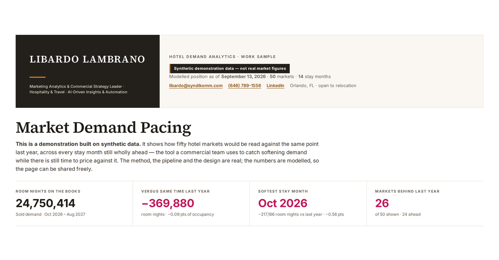

# Hotel Market Demand Pacing

An interactive pacing dashboard for fifty hotel markets: where each one stands
against the same point last year, across every stay month still wholly ahead —
the read a commercial team needs while there is still time to move rate, shift
channel mix or chase group business.



**[Open the live demo →](https://claude.ai/artifact/4GegBCQ7sctDFaQwoCgbUF)**
· or clone this repo and open `synthetic-demo.html` in a browser. It is one
self-contained file: no server, no build step, no network calls.

---

## The data on this page is synthetic

The working version of this report reads an **Amadeus Hospitality —
*Destination Insights: Market Daily Occupancy*** export: one workbook per
airport comp set, every stay date out to the file's horizon, at a single as-of
date. Amadeus [supplies it on request](https://www.amadeus-hospitality.com/local-market-report/)
at no cost, but it is not published data and the figures are Amadeus's, so none
of them appear in this repository.

Everything here runs on a dataset generated by
[`scripts/make_synthetic.py`](scripts/make_synthetic.py) instead — same shape,
same statistical character, no real measurements. The page says so in its
masthead, standfirst, source line and footnotes. Swapping the synthetic file
for a real export is one command and nothing else changes.

What the generator models, and why each part earns its place:

| | |
|---|---|
| **Booking curve** | Steep exponential decay with lead time. The page's whole argument is that a low far-out month means *unbooked*, not *weak* — without this the dashboard teaches the wrong lesson. |
| **Seasonality** | A summer term for every market, a second winter-sun term for leisure-weighted ones, a December trough for business-weighted ones. |
| **Market size** | Lognormal capacities from ~4k to ~86k rooms, so size-weighting matters and small markets are visibly volatile. |
| **Unsold group block** | Grows with lead time, which is what makes the Sold-vs-Totals argument real. |
| **Pacing vs last year** | A *relative* change on the level held, per market and month, with a per-region bias — so near months move in whole points and far months in tenths, as they do in life. |

---

## What's in here

```
dashboard.html                   the page template — layout, styling, all the
                                 rendering logic; data is injected at build time
synthetic-demo.html              the built page, ready to open
data/market_demand_synthetic.json
scripts/
  build_monthly.py               50 daily workbooks  ->  one monthly dataset
  make_payload.py                monthly CSV         ->  the page's JSON payload
  make_synthetic.py              the synthetic data generator
  build.py                       template + real payload      -> page
  build_synthetic.py             template + synthetic payload -> shareable page
config/market_regions.example.json
images/
```

### Running it

```bash
python3 scripts/make_synthetic.py      # regenerate the synthetic dataset
python3 scripts/build_synthetic.py     # -> synthetic-demo.html
```

Against a real export:

```bash
python3 scripts/build_monthly.py "raw data/2026/09 15" processed
python3 scripts/make_payload.py processed/market_demand_monthly_*.csv \
        data/market_demand_monthly.json
python3 scripts/build.py               # -> market-demand-pacing.html
```

`build_monthly.py` needs `config/market_regions.json` (copy the example and fill
in your own markets — the workbooks carry no region or country). The real data
paths are in `.gitignore`; nothing from an export is tracked here.

---

## Notes on how it is built

**One template, two editions.** `dashboard.html` is the single source of truth.
`build_synthetic.py` derives the shareable edition from it by applying a list of
text substitutions and **fails loudly if any of them stops matching**, so a
reworded paragraph cannot silently drift out of the public version. It also
asserts that four separate synthetic-data disclaimers are present in the output
before it will write the file.

**The month window is derived, not written down.** Two boundaries are computed
from the payload: the first stay month wholly ahead of the as-of date, and the
last month the file covers completely. The window options, their labels, the
as-of line and the source line's dates all follow. Pointing the page at a newer
export needs no text edits.

That first boundary matters more than it sounds. The as-of month is excluded
because part of it has already been stayed, so its occupancy mixes nights slept
in with nights on the books. On the real export, leaving it in added more than
half a million room nights of apparent gain against last year that was simply
time passing.

**Every aggregate is reconciled before it ships.** Against a real export, each
monthly figure is checked against the source's own subtotal rows — which is how
a real bug surfaced: the aggregation treated *any* all-zero day as missing data.
True for markets whose zeros are the trailing days past the export horizon;
wrong for a small market whose zero days are scattered and genuine, because at
2,000-odd rooms a single booked room is 0.05% occupancy. Only a trailing
contiguous run of zeroes counts as the horizon now.

**Colour does exactly four jobs.** Neutrals for page furniture, one amber for
interaction, a red↔green diverging scale for pacing, and a single-hue bronze
ramp for the segment mix. Nothing else. Two consequences worth stating:

- Red↔green separates by only ΔE 3.5 under deuteranopia. It stays because it is
  the convention a commercial team reads fastest, but the sign never rests on
  hue alone: every cell carries a signed number and a red-to-blue scale is one
  click away in the controls.
- The "behind" pole is a magenta-leaning crimson rather than a pure red,
  because against the amber accent sitting beside the grid a pure red separated
  by only ΔE 14.9 in normal vision — below the usable floor. It now reads 17.2.

**Every chart has a table twin.** The pacing grid, the portfolio trend and the
booking curve each toggle to the underlying numbers, so no value is reachable
only by hovering.

---

## Contact

**Libardo Lambrano** — marketing analytics and commercial strategy for hotels
and travel, in English and Spanish.

[libardo@syndikomm.com](mailto:libardo@syndikomm.com) ·
[linkedin.com/in/libardo-lambrano](https://www.linkedin.com/in/libardo-lambrano/)
